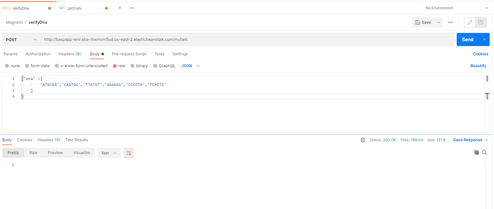
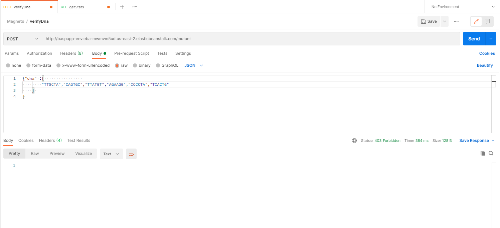
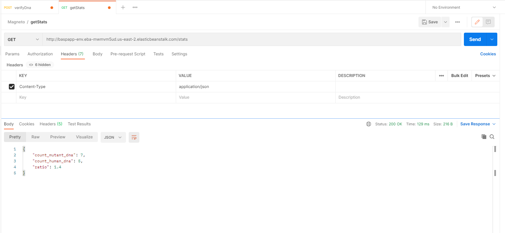

# Magneto

Magneto quiere reclutar la mayor cantidad de mutantes para poder luchar
contra los X-Men. Este proyecto permite detectar si un
humano es mutante basándose en su secuencia de ADN.

## Comenzando 🚀

Dentro del proyecto se encuentra una carpeta llamada **project-resources**, la cual contiene el contrato y las pruebas de los servicios expuestos, junto con el reporte de pruebas sobre la versión actual. Para propósitos de validación en tal caso que no se despliegue el proyecto localmente. 


### Pre-requisitos 📋

**AWS**

Para el consumo sobre AWS se requiere abrir la colección de Postman y consumir según el contrato (Swagger). Ambos recursos encontrados en la carpeta descrita anteriormente **(project-resources)**

_Cabe resaltar que la base de datos de AWS se encontrará vacía para no alterar las futuras pruebas_

**Local**

Para ejecutar localmente, puede sincronizar el repositorio git, la  gestión de dependencias se hace mediante Gradle y Maven, debido a esto es necesario tener acceso al repositorio central de Maven y sincronizar gradle para realizar la descarga de todas las dependencias requeridas para la implementación. 

En el ámbito de base de datos, la solución ha sido implementada sobre MySQL, debido a esto es necesario tener instalado MySQL Server, en caso de usar otro gestor de base de datos, se debe configurar el archivo de propiedades **application-default.yml** con el nuevo datasource, de igual manera agregar el driver de acceso mediante R2DBC en **build-dependencies.gradle**.

Igual que el consumo sobre AWS, utilizar la colección Postman y cambiar a url local.

### Instalación 🔧

- Crea la base de datos **magneto** y luego ejecuta el script **project-resources/scripts/table_script.sql**

```
CREATE TABLE `magneto`.`DNA` (
  `DNA_ID` BIGINT NOT NULL AUTO_INCREMENT,
  `DNA_VALUE` MEDIUMTEXT NOT NULL,
  `DNA_MUTANT` TINYINT NOT NULL,
  PRIMARY KEY (`DNA_ID`))
ENGINE = InnoDB
DEFAULT CHARACTER SET = utf8;
```

El cual creara la tabla solicitada para agregar los ADN analizados. 

- Sincronizar el repositorio Git.
- Sincronizar dependencias y luego limpiar y construir. Esto con el fin de obtener el proyecto listo para desplegar. _Tenga en cuenta que esto puede realizarlo desde consola o con un IDE que soporte Java_
- Una vez construido, se creara una carpeta llamada build, la cual generara la libreria **build/libs/Magneto-1.0.jar** listo para desplegar.

## Ejecutando las pruebas ⚙️
Dentro del repositorio encontramos **project-resources/reports** con el reporte de las pruebas generadas sobre la versión final. Igualmente, al momento de construir el proyecto, dentro de la carpeta **build** se generaran los reportes de la última versión compilada.

### Evidencia pruebas end-to-end 🔩

A continuación se agregan algunas evidencias de la colección de Postman, de como debería responder cuando son llamadas las API.

- Verificación de ADN
    
    




- Estadísticas



## Construido con 🛠️

Las herramientas utilizadas para la implementación de la solución son: 

* [AWS](https://aws.amazon.com/) - Despliegue en la nube
* [MySQL](https://www.mysql.com/) - Gestor de base de datos

* [Java 8](https://www.java.com/es/download/help/java8.html) - Lenguaje programación
* [SpringBoot](https://spring.io/projects/spring-boot) - Framework de desarrollo
* [Gradle](https://gradle.org/) - Configuración del proyecto
* [Maven](https://maven.apache.org/) - Gestor de dependencias
* [Jacoco](https://www.eclemma.org/jacoco/) - Análisis de pruebas y cobertura. 

Otros
* [Bizagi](https://www.bizagi.com/) - Diseño proceso
* [Swagger](https://editor.swagger.io/) - Diseño contrato
* [Postman](https://www.postman.com/) - Consumo de APIs


## Autores ✒️


* **Bryan Silva** - *Diseño, desarrollo, implementación y documentación* - [bryansilvagit](https://github.com/bryansilvagit) - [basp.95@outlook.com](mailto:basp.95@outlook.com)

## Licencia 📄

Este proyecto está desarrollado sobre la prueba técnica solicitada por [Mercado Libre](https://github.com/bryansilvagit/magneto/blob/4120ac3ab80474bd609d470dca26fa184e7da86b/project-resources/Mutantes.pdf)


---
⌨️ con ❤️ por [bryansilvagit](https://github.com/bryansilvagit) - [basp.95@outlook.com](mailto:basp.95@outlook.com)